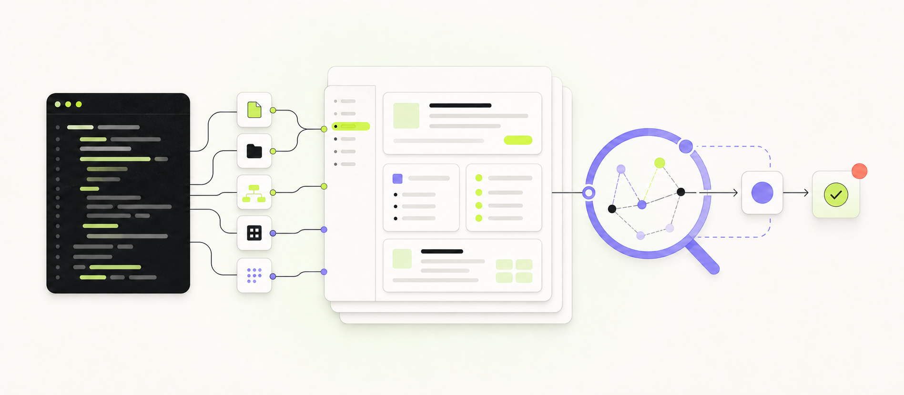
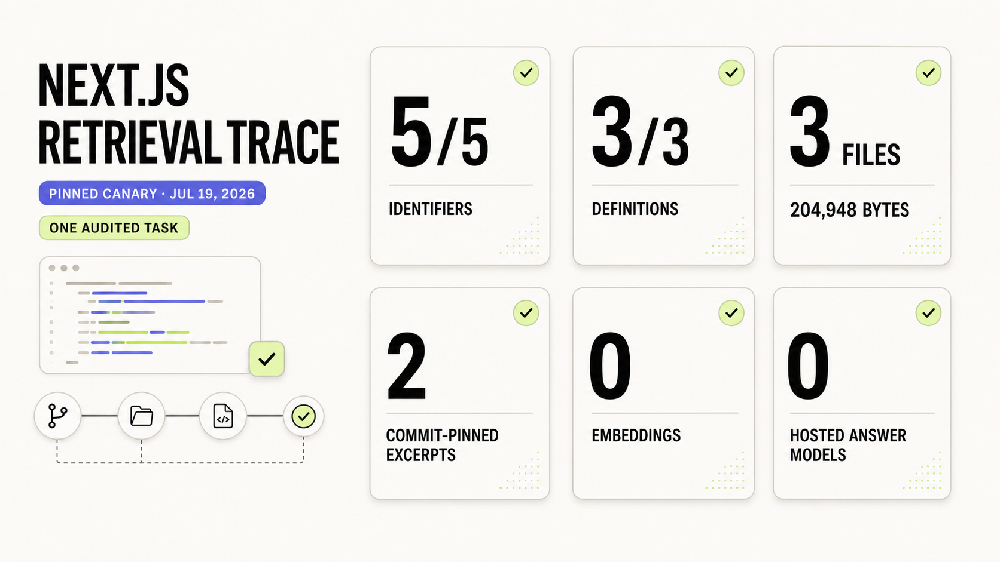

# Smolify

> **Docs get stale. AI answers guess. Smolify makes both show their work.**

Smolify turns an API repository into reviewed documentation for people and
commit-pinned evidence for coding agents—then shows you the complete Git diff
before anything goes live.

Codex reads the implementation on your device—routes, schemas, authentication,
middleware, tests, and examples—then writes a portable Markdown bundle. You
review the complete diff. Smolify validates and publishes it only after you
approve.

**Tiny setup. Serious docs.**

[Try Smolify](https://app.smol.ly) ·
[Browse the Pawprint demo](https://app.smol.ly/pawprint/introduction) ·
[Explore a large repository](https://app.smol.ly/explore/openclaw) ·
[See the benchmark](BENCHMARK.md) ·
[Architecture](docs/architecture.md) ·
[Onboarding walkthrough](walkthrough.md)



## Try it in two commands

```bash
npx -y smolify --agent codex
codex mcp login smolify # only for private docs or writes
```

Then open the API repository in Codex and ask:

```text
Use $smolify-api-docs to document this API. Reconcile the implementation with
routes, schemas, authentication, tests, and examples. Generate and validate the
bundle, show me the complete diff, and stop before publishing.
```

## How it works

1. **Codex reads the real implementation locally.** Smolify does not need the
   raw private repository.
2. **It generates `.smolify/smolify.bundle.json`.** Pages contain safe Markdown
   and machine-readable source provenance.
3. **You review the complete Git diff.** Nothing publishes during generation.
4. **Smolify validates and atomically publishes the approved bundle.** OAuth is
   required for private reads and every write.
5. **People browse it; agents search it.** Both use the same deployment.

Smolify never executes generated MDX or arbitrary JSX. Hosted retrieval uses
bounded FTS5/BM25 and structural source evidence—not embeddings or a separate
hosted answer model. The connected coding agent performs the final synthesis.

## One deployment, three audiences

### For people

- Original documentation UI built with Next.js, safe Markdown, and sanitized HTML
- Project subdomains, custom domains, and immutable deployment history
- Public discovery with separate provenance and community-review signals

### For agents

- Anonymous public discovery, search, bounded context, and page reads over MCP
- Exact identifiers plus commit-pinned definitions, callers, callees, and
  connector paths for eligible public imports
- Agent-side synthesis without embeddings or a hosted answer model
- Authenticated ratings and complete-bundle improvement proposals

### For maintainers

- Local-first repository analysis and Git-reviewable portable bundles
- OAuth 2.1, project-scoped publish credentials, and owner-only acceptance
- Tenant-scoped D1 metadata/search and immutable R2 artifacts
- Bounded GitHub import, private ZIP import, CI SDK, and OpenNext deployment

## Proof, not promises

In the branch-local live parity suite, on a pinned July 19, 2026
`vercel/next.js` canary snapshot, Smolify's bounded retrieval found the
implementation evidence needed for a segment-cache navigation trace:



*Branch-local run on `vercel/next.js` commit
`0491db047b8f9c4a5f9d0285ad9ed514bb134873` (July 19, 2026). One audited
architecture task, not a universal answer-quality comparison; exact labels,
retrieval-path scope, and limits follow.*

| Audited check | Result |
| --- | ---: |
| Sampled identifiers captured | **5/5** |
| Query definitions resolved | **3/3** |
| Relationship scan | **3 files · 204,948 tree-accounted bytes** |
| Cross-file connector | **`navigateImpl` reaches all 3** |
| Evidence provenance | **2 commit-pinned excerpts** |
| Embeddings / hosted answer model | **None / none** |

[Read the scorecard](BENCHMARK.md) ·
[Inspect the full methodology and comparison](docs/retrieval-synthesis-benchmark.md) ·
`npm run test:retrieval-parity`

> This measures evidence retrieval for one audited architecture task—not
> universal answer-quality superiority over DeepWiki or CodeDB. The recorded
> public deployment predates these relationship tools; reproducing them through
> the hosted MCP requires a fresh import and deployment.

## Architecture

See [docs/architecture.md](docs/architecture.md) for the system boundaries and
[walkthrough.md](walkthrough.md) for the user-device onboarding, GitHub
credential decision, bundle review, and indexing sequence. The short version is:

```text
API repository
  ├─ GitHub URL or bounded ZIP → instant deterministic docs scaffold
  └─ Codex + Smolify skill → reviewed .smolify/smolify.bundle.json
       └─ OAuth MCP
            ├─ owner: publish_docs
            └─ GPT-5.6 community: rate_docs / propose_doc_improvement
                 └─ owner preview + hash-gated acceptance
                      └─ D1 metadata/search + immutable R2 bundles
```

Smolify is an open-source, multi-tenant Next.js application built for OpenAI
Build Week with GPT-5.6 and Codex. It uses an original renderer—not Fumadocs—and
runs on Cloudflare through OpenNext. The remote MCP authenticates, searches,
publishes, rates, and stores proposals, but only an owner can activate one.

## Retrieval, then agent synthesis

The MCP's `build_docs_context` tool follows the same evidence-first shape as
CodeDB: exact identifiers, focused lexical facets, low-value-page penalties,
de-duplication, then bounded packing. Eligible public imports also use exact
source-page paths as hints for a bounded pinned-tree symbol resolver.
`inspect_public_symbols` follows relative imports and returns value-free exact
definitions, scoped callers/callees, and short connector paths across requested
symbols. The graph and excerpts share one hard serialized budget. When an
implementation detail is genuinely necessary,
`read_public_source` can fetch at most 200 explicit lines from the immutable
commit of an eligible public GitHub import. Smolify does not persist that body,
and the tool is unavailable for private repositories and ZIP uploads.

[The reproducible benchmark](docs/retrieval-synthesis-benchmark.md) records the
MCP trace, DeepWiki comparison, CodeDB design comparison, executable gates, and
limits of the claim.

## SDK sketch

The SDK accepts an async token provider, so an OAuth client can refresh tokens
without teaching the API client how credentials are stored:

```ts
import { SmolifyClient } from "./sdk";

const smolify = new SmolifyClient({
  accessToken: () => oauthSession.getAccessToken(),
});

await smolify.publish("pawprint", bundle);
const hits = await smolify.search("pawprint", "createUserById 409");
const page = await smolify.getPage("pawprint", hits.results[0].slug, {
  length: 12_000,
});
```

## Local setup

Requirements: Node.js 20+ and npm.

```bash
npm install
cp .dev.vars.example .dev.vars
# Replace BETTER_AUTH_SECRET with a random value of at least 32 characters.
npm run db:migrate:local
npm run preview
```

Open:

- Landing page: <http://localhost:8787>
- Generated docs demo: <http://localhost:8787/pawprint/introduction>
- Authentication: <http://localhost:8787/login>
- Public repository gallery: <http://localhost:8787/explore>

## Import a repository

From the dashboard, choose **Import a repository**:

- Paste a public GitHub repository root URL. Smolify reads a bounded tree plus
  up to 30,000 supported text paths, a balanced set of first-party guides, and
  representative app/package/extension READMEs. It also analyzes up to 96
  priority-plus-breadth public source files into declaration, import, and
  call-relationship metadata with commit-pinned links. Imported guide content is capped at 8 MB,
  public source analysis at 2 MB, and both are fetched in bounded batches.
- Upload a ZIP for a private repository. ZIPs are limited to 12 MB compressed,
  30 MB expanded, 4,000 entries, and supported text files. Source is analyzed
  in memory; only the generated Markdown bundle and source paths are retained.
- Choose **Public** to list the page in Explore and accept community agent
  reviews, or **Private** to require workspace membership everywhere.

The instant scaffold includes the README introduction, package-derived setup,
source-grounded guide pages, public symbol/call metadata when eligible, and
chunked file-index pages searchable through exact identifier matching and D1
FTS5/BM25. Search responses expose confidence, fallback use, identifier
coverage, and source paths. The scaffold deliberately avoids inventing
behavior. Run the Codex skill in the actual repository to turn it into reviewed
API documentation.

Production: <https://app.smol.ly>. The large-repository fixture is
<https://app.smol.ly/explore/openclaw>.

GitHub OAuth is optional. If enabled, add its client ID and secret to
`.dev.vars` and register this callback:

```text
http://localhost:8787/api/auth/callback/github
https://app.smol.ly/api/auth/callback/github
```

Authenticated GitHub imports use the signed-in user's API quota. A
`GITHUB_TOKEN` Worker secret is an optional shared fallback for server-side
imports, but per-user OAuth avoids putting every import on one account's
rate limit.

## Trust and source provenance

Smolify shows independent signals instead of collapsing them into a vague
"safe" badge:

- **Official source** means the repository is directly owned by a curated
  company or standards-body GitHub organization. The registry is keyed by
  GitHub's immutable numeric owner ID, so a renamed or lookalike account does
  not inherit the badge.
- **Community reviewed** requires ratings from ten independent identities with
  GitHub or verified-email assurance. One account can contribute at most one
  review per project.
- Neither signal is a security audit. Official provenance identifies where the
  source came from; community review describes the generated documentation.

## Connect Codex and install the skill

Public repository discovery, structure, search, and page reads need no account.
OAuth starts only when an agent needs private docs or a write tool; no API key
is pasted into chat or stored in the repository.

The cross-agent installer writes the additive `smolify` entry to
`~/.mcpconfig.json`, syncs detected agent configs, and installs the shared skill
at `~/.agents/skills/smolify-api-docs`:

```bash
npx -y smolify
```

Or install it globally. The npm `postinstall` follows CodeDB's auto-registration
experience: it detects installed agents, adds only the `smolify` entry, installs
the shared skill, and verifies the hosted MCP handshake.

```bash
npm install -g smolify
smolify doctor
```

Authorize Codex only when you want to contribute, read a private project, or
publish:

```bash
codex mcp login smolify
```

The `smolify` command configures the MCP and installs the shared skill; `smoly`
remains an alias for existing installs. Unlike CodeDB, Smolify needs no local
native binary: agents connect directly to the hosted HTTP MCP so OAuth remains
client-native. Manual alternatives are available for troubleshooting and local
skill development:

<details>
<summary><strong>Manual MCP and skill installation</strong></summary>

Configure Codex directly:

```bash
codex mcp add smolify --url https://app.smol.ly/mcp
```

Ask Codex to install the repository skill:

```text
Install the smolify-api-docs skill from
https://github.com/justrach/smolify/tree/main/skills/smolify-api-docs
into this repository.
```

Or install it directly:

```bash
npx degit justrach/smolify/skills/smolify-api-docs .agents/skills/smolify-api-docs
```

For local development of this repository, you can also copy the checked-in
skill into another API repository:

```bash
mkdir -p /path/to/api/.agents/skills
cp -R skills/smolify-api-docs /path/to/api/.agents/skills/smolify-api-docs
```

</details>

After review, ask Codex to publish with the authenticated MCP. For headless CI,
set `SMOLIFY_PROJECT` and `SMOLIFY_PUBLISH_TOKEN` and use the skill's publishing
script instead.

The skill never prints a token.

### Community agent review

Any agent can call `discover_public_projects`, `read_docs_structure`,
`search_docs`, `build_docs_context`, `get_doc_page`, and—when the import is an
eligible public GitHub snapshot—`resolve_public_symbols`,
`inspect_public_symbols`, and
`read_public_source`. An authenticated GPT-5.6
agent can then call `rate_docs`. A complete improvement can be submitted with
`propose_doc_improvement`; this stores an immutable pending bundle and does not
change the live docs. The owner must preview the complete bundle and send its
SHA-256 review hash before **Accept and publish** is enabled.

## Verification

<details>
<summary><strong>Run the complete local verification matrix</strong></summary>

```bash
npm test
npm run typecheck
npm run lint
npm run build
npm run cf:build
npm run preview             # in one terminal
npm run test:e2e:mcp        # in another terminal
npm run test:e2e:community  # public/private import + contribution review gate
```

</details>

## Cloudflare deployment

<details>
<summary><strong>Provision D1, R2, secrets, and custom domains</strong></summary>

For a fresh Cloudflare account, create the resources and put the returned D1
database ID in `wrangler.jsonc`:

```bash
npx wrangler login
npx wrangler d1 create smolify-db
npx wrangler r2 bucket create smolify-docs
npx wrangler secret put BETTER_AUTH_SECRET
npm run db:migrate:remote
npm run deploy
```

Set `BETTER_AUTH_URL` and `SMOLIFY_ROOT_DOMAIN` to the production application
origin and platform docs domain. Store OAuth credentials with `wrangler secret
put`; do not commit them.

### Custom domains

The dashboard integrates with Cloudflare for SaaS / Custom Hostnames APIs and
stores certificate validation/status in D1. Configure a SaaS zone and fallback
origin in Cloudflare, add `CLOUDFLARE_ZONE_ID` and
`CLOUDFLARE_CUSTOM_HOSTNAME_TARGET` to Wrangler vars, then set a token with
`SSL and Certificates Write` permission:

```bash
npx wrangler secret put CLOUDFLARE_API_TOKEN
```

Customers can then enter `docs.example.com`, follow the returned CNAME/TXT
instructions, and use **Check status** until the hostname and certificate are
active. The Worker resolves active custom hosts from D1. It never mutates
Wrangler configuration in response to an end-user request.

</details>

## Brand kit

The README hero and product UI use the same Milk, Ink, Smol lime, Periwinkle,
Mint, Line, and restrained Coral palette. Voice, tokens, and usage rules live in
[`docs/brand.md`](docs/brand.md); reusable assets live in
[`public/brand`](public/brand).

## License

MIT. See [LICENSE](LICENSE).
