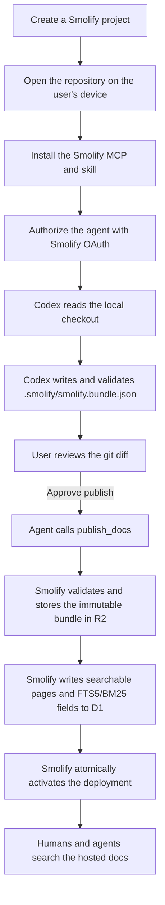

# Smolify onboarding and indexing walkthrough

This walkthrough separates three operations that are easy to call “indexing”
but have different security and credential boundaries:

1. **Repository analysis** — an agent reads source code and produces reviewed
   Markdown documentation.
2. **Repository import** — Smolify optionally reads a GitHub repository or ZIP
   to make a deterministic starter scaffold.
3. **Documentation indexing** — Smolify turns an approved docs bundle into the
   hosted D1 FTS5/BM25 search corpus.

The recommended product flow is local-first: repository analysis happens on the
user's device, while Smolify receives only the generated documentation bundle.

## Do users need a GitHub token?

Usually, no.

| Path | Where source is read | GitHub credential | What Smolify receives |
| --- | --- | --- | --- |
| Existing local checkout, recommended | User's agent on their device | None | Reviewed docs bundle |
| Clone a repository first | `git` or `gh` on the user's device | Managed locally by Git or GitHub CLI | Nothing during clone |
| Paste a public GitHub URL | Smolify's Cloudflare Worker | Optional, but authenticated requests have more quota | Bounded guides plus value-free public symbol/call metadata used to build starter docs |
| Paste a private GitHub URL | Smolify's Cloudflare Worker | User's connected GitHub OAuth token is required | Bounded source content used to build starter docs |
| Upload a private ZIP | Smolify's Cloudflare Worker | None | ZIP analyzed in memory; generated docs bundle retained |
| Publish and build BM25 search | Smolify's Cloudflare Worker | None; Smolify MCP OAuth authorizes the publish | Validated docs bundle |

The Smolify MCP OAuth token and a GitHub credential are separate:

- **Smolify OAuth** authorizes project reads, contributions, and publishing.
- **GitHub authentication** is needed only to clone/fetch a repository that the
  user cannot already read locally, or to use the hosted GitHub importer with
  the user's GitHub quota.

Never ask a user to paste a GitHub personal access token into an agent chat,
Smolify bundle, repository file, or committed environment file.

## Recommended local-first onboarding



### Screen 1: Choose where the source lives

The first onboarding choice should be explicit:

#### Use a local checkout — recommended

> Best for private repositories and accurate docs. Your coding agent reads the
> repository on this device. Smolify receives only the documentation bundle you
> review and approve.

This path should not ask for GitHub access. If the repository is not cloned,
the user can clone it with their normal Git or GitHub CLI setup:

```bash
gh repo clone owner/repository
cd repository
```

GitHub CLI owns that device credential. Smolify never needs to receive it.

#### Import from GitHub

> Create starter docs from a GitHub URL. Connect GitHub for private repositories
> or to use your GitHub account's request quota.

This is a convenience path, not the strict device-only path. Smolify's Worker
performs the fetch.

#### Upload a ZIP

> Upload a bounded private snapshot. Source is analyzed in memory; only the
> generated documentation bundle and source paths are retained.

This needs no GitHub credential, but the source archive does cross the device
boundary during upload.

### Screen 2: Create the hosted project

The user chooses:

- project name and slug;
- public or private visibility;
- the default `app.smol.ly/{project}` address;
- an optional custom domain after the first deployment.

Creating a project does not index source code. It creates an authorization and
publishing target for the agent.

### Screen 3: Install Smolify for the agent

From the user's device:

```bash
bunx smoly install --agent codex
```

The current installer:

- adds the hosted `https://app.smol.ly/mcp` server to the shared mcpsync source;
- updates the detected Codex or other agent configuration additively;
- installs `smolify-api-docs` under the user's shared agent skills directory;
- preserves unrelated MCP servers and agent settings;
- writes no access token into the repository.

Public Smolify documentation can be searched immediately. Private project
access and publishing require Smolify OAuth:

```bash
codex mcp login smolify
```

This authorizes Codex to Smolify. It is not a GitHub login.

### Screen 4: Generate documentation locally

The dashboard supplies a project-specific prompt:

```text
Use $smolify-api-docs to document this API for the Smolify project
"PROJECT_SLUG". Reconcile the API contract with routes, schemas, middleware,
tests, and examples. Generate the bundle, show me the complete docs diff, and
wait for my explicit approval before calling publish_docs.
```

Codex then works inside the local checkout:

1. reads `AGENTS.md` and the installed Smolify skill;
2. inventories contracts, routes, schemas, authentication, tests, and examples;
3. records disagreements instead of guessing;
4. writes `.smolify/smolify.bundle.json` using safe Markdown only;
5. records supporting repository paths in each page's `sourceFiles`;
6. validates the bundle locally;
7. shows the user the git diff;
8. stops before publishing.

No GitHub API call is required because the agent already has local filesystem
access to the checkout. The agent must not include secrets from environment
files, fixtures, logs, or code in the generated bundle.

### Screen 5: Review and publish

The review screen should make the boundary visible:

- **Stays on this device:** raw repository, git history, ignored files, local
  credentials, and rejected drafts.
- **Will be uploaded:** the validated Markdown bundle, navigation, page
  metadata, and `sourceFiles` paths shown in the diff.
- **Will never be uploaded by this flow:** a GitHub token or raw repository
  archive.

Only after the user approves does the agent call the authenticated MCP tool:

```text
publish_docs(project, bundle)
```

`publish_docs` requires the short-lived `docs:publish` Smolify OAuth scope and
is marked as a mutating external action. The MCP client keeps its access and
refresh tokens; the agent should never print them or copy them into the bundle.

### Screen 6: Server-side docs indexing

After publish, Smolify—not the user's device—builds the hosted documentation
search index:

1. validate the complete bundle and tenant/project authorization;
2. write the immutable bundle to R2 under
   `projects/{projectId}/deployments/{deploymentId}/bundle.json`;
3. normalize each page into title, description, headings, API symbols, body
   text, and source-file fields;
4. insert the pages into D1 with prepared statements;
5. let the D1 FTS5 triggers synchronize the BM25 corpus;
6. atomically update `active_deployment_id` only after every page is indexed.

Search therefore sees either the previous complete deployment or the new
complete deployment. A partially indexed release is never made active.

## Current hosted GitHub import flow

The dashboard's existing **GitHub URL** path is server-side:

1. the user signs in to Smolify;
2. the browser sends the repository URL and desired visibility to
   `/api/v1/imports/github`;
3. Smolify looks for a GitHub provider access token attached to that Better Auth
   user;
4. if none exists, Smolify falls back to its optional `GITHUB_TOKEN` Worker
   secret, then to an unauthenticated public request;
5. the Worker reads repository metadata, the recursive tree, and a bounded,
   balanced set of supported text files;
6. for a public repository, the Worker extracts declaration, import, and call
   names from a bounded source set, discards implementation text and literal
   values, and records commit-pinned source links; private repositories remain
   metadata-only;
7. the deterministic importer produces starter Markdown without calling a
   model;
8. Smolify publishes and indexes that starter bundle;
9. the dashboard sends the user into the local Codex flow to replace the
   scaffold with reviewed documentation.

For eligible public imports, later MCP reads can fetch one explicitly requested
source path from that exact commit. Exact identifier misses may also check
source-file hints and a ranked pinned-tree sample capped at 96 files/4 MB. The
reader rejects traversal and sensitive/config paths, caps each upstream file at
512 KB, returns bounded evidence, and does not persist the response. Private
GitHub and ZIP imports cannot use this path.

When GitHub OAuth is connected, the request is charged to that user's GitHub
quota. However, the request still originates from Smolify's Worker and the
provider credential is available to the server-side Better Auth integration.
Use the local-checkout path when the requirement is that the GitHub credential
must remain exclusively on the user's device.

## Product copy for the credential decision

Use this copy before any GitHub authorization prompt:

> **How should Smolify read your repository?**
>
> **On this device — recommended**
>
> Codex reads your existing checkout. No GitHub access is given to Smolify, and
> only reviewed documentation is uploaded.
>
> **Import through GitHub**
>
> Smolify reads a bounded repository snapshot to create starter docs. Connect
> GitHub for private repositories or to use your account's request quota.

The GitHub consent screen should be shown only after the user chooses the
hosted import path. Smolify MCP authorization belongs later, when the user
connects an agent or publishes.

## What is implemented and what remains

Implemented now:

- hosted MCP installation across supported agents;
- repository-local Smolify skill;
- Smolify OAuth for private reads, contributions, and publishing;
- local bundle generation, validation, and review instructions;
- server-side GitHub and ZIP starter imports;
- per-user GitHub OAuth token preference with a shared-token fallback;
- immutable R2 bundles and D1 FTS5/BM25 indexing.

Still worth adding to make the local-first path feel native:

1. Promote **Use a local checkout** above **Import from GitHub** in the first
   dashboard screen.
2. Add an explicit project-link command to `smoly`, so the user can bind the
   current directory to a project without copying a prompt by hand.
3. Let `smoly status` verify the MCP connection, installed skill, current
   project link, and OAuth identity in one view.
4. Replace the dashboard's local-storage “skill installed” checkbox with a
   device callback or MCP-reported installation status.
5. Show a publish manifest listing every page and source path that will cross
   the device boundary before approval.
6. Keep hosted GitHub import as an optional fast-start path, not the default
   private-repository onboarding.

That division keeps the trust model simple: the user's agent understands the
repository locally; Smolify validates, indexes, and hosts the documentation the
user explicitly approved.
